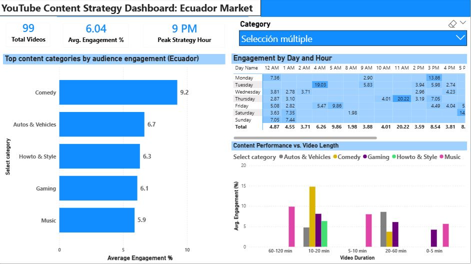

# 📊 YouTube Content Strategy Dashboard (Ecuador Market)

## 🖼️ Dashboard Preview

## 📋 Project Overview
This project provides a data-driven framework for content creators in the Ecuadorian market to optimize their reach. By analyzing trending YouTube data, the dashboard identifies the **"Golden Hour"** for publishing and the ideal video duration to maximize audience engagement across different niches.

---

## 🛠️ Data Engineering Workflow
> **Technical Note:** This project utilizes a hybrid architecture, leveraging **R** for heavy data lifting and **Power BI** for high-impact visualization.

### 1. ETL & Data Wrangling (RStudio)
* **Pre-processing:** Cleaned raw YouTube metadata using **R**, handling missing values and data type normalization.
* **Feature Engineering:** Developed `duration_range` bins to transform continuous time data into categorical "buckets" for better trend analysis.
* **Temporal Logic:** Formatted timestamps to enable accurate hourly mapping for the strategy heatmap.

### 2. Data Modeling & UI (Power BI)
* **DAX Implementation:** Created custom measures for **Average Engagement Rate** and **Peak Strategy Hour**.
* **Semantic Design:** Developed a high-contrast, dark-themed UI designed for executive decision-making.

---

## 💡 Key Strategic Insights
* **Market Engagement Benchmark (6.04%):** Across the top-performing niches in Ecuador, the average engagement rate sits at 6.04%, indicating a highly interactive audience compared to global averages.
* **The "Golden Hour":** Statistical analysis identifies **9:00 PM** as the peak engagement window for the Ecuadorian audience.
* **The 10-20 Min Sweet Spot:** Data reveals a significant engagement spike (reaching **~15%**) for **Comedy** content specifically when videos are between 10 and 20 minutes long.

---

## 🎯 Contextual Analysis: Top-Performing Cohort
The current dashboard view and KPI results focus on a multi-select filter of the **Top 5 High-Reach Categories** in the Ecuadorian ecosystem:
* 🟡 **Comedy** (Top Performer)
* ⚪ **Autos & Vehicles**
* 🟢 **Howto & Style**
* 🟣 **Gaming**
* 💗 **Music**

By isolating these specific niches, the analysis provides a targeted benchmark, allowing for a more relevant comparison of engagement signals across the most active sectors of the platform.

---

## ⚖️ Strategic Nuance: Beyond the Average
While the **9:00 PM KPI** represents the general peak, the dashboard is designed to account for **Contextual Variance**:
* **Niche Specificity:** Audience behavior shifts by category. While Entertainment peaks late, "How-to" or "Education" niches often see earlier spikes.
* **The "Buffer" Rule:** To hit a 9:00 PM engagement peak, the optimal upload time is suggested between **7:00 PM - 8:00 PM** to allow for platform indexing and algorithmic momentum.

---

## ⚙️ Technical Features
* **Multi-Select Filtering:** Integrated slicers allow for side-by-side comparison of specific content niches.
* **Heatmap Analysis:** A temporal matrix that visualizes audience "availability" patterns throughout the 24-hour cycle.
* **Interactive KPIs:** Dynamic cards that update real-time metrics based on selected categories and timeframes.

---

## 📂 Repository Structure
* `youtube-strategy-dashboard.pbix`: The primary Power BI report file.
* `youtube-data-cleaning.R`: The R script used for the ETL and data transformation process.
* `YouTube_Strategy_Dashboard.JPG`: High-resolution preview of the final dashboard.

## 🚀 How to Use
1. Clone the repository.
2. Run the `youtube-data-cleaning.R` script in RStudio to see the data transformation.
3. Open `youtube-strategy-dashboard.pbix` in Power BI Desktop to interact with the findings.
